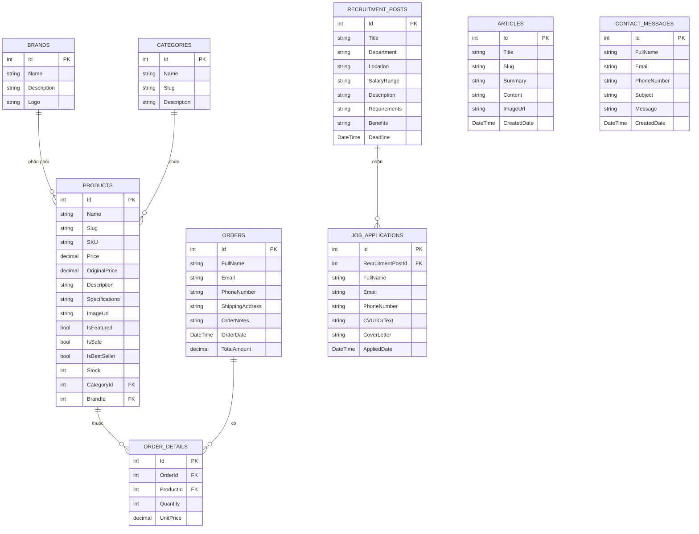

# BÁO CÁO ĐỀ TÀI ĐỒ ÁN TỐT NGHIỆP

**ĐỀ TÀI: XÂY DỰNG WEBSITE THƯƠNG MẠI ĐIỆN TỬ BÁN LẺ THIẾT BỊ CÔNG NGHỆ - PROTECH SYSTEMS**

---

## CHƯƠNG 1: GIỚI THIỆU ĐỀ TÀI

### 1.1. Lý do chọn đề tài
Trong thời đại công nghệ số 4.0, nhu cầu mua sắm thiết bị công nghệ (điện thoại, laptop, máy tính bảng, phụ kiện...) chính hãng ngày càng tăng cao. Người tiêu dùng có xu hướng lựa chọn mua sắm trực tuyến nhờ sự tiện lợi, nhanh chóng và đa dạng lựa chọn. Việc xây dựng một website thương mại điện tử chuyên nghiệp, giao diện hiện đại, tối ưu trải nghiệm người dùng (UX) và tích hợp các tính năng mua sắm thông minh là vô cùng cần thiết đối với các doanh nghiệp bán lẻ công nghệ. 

Đề tài **"Xây dựng Website Thương mại Điện tử Protech Systems"** được lựa chọn nhằm giải quyết bài toán trên, cung cấp giải pháp mua sắm thiết bị công nghệ trực quan, an toàn và chuyên nghiệp.

### 1.2. Mục tiêu của đề tài
- Nghiên cứu và áp dụng mô hình thiết kế phần mềm **MVC (Model-View-Controller)** trong ASP.NET Core.
- Xây dựng cơ sở dữ liệu quan hệ hoàn chỉnh quản lý sản phẩm, thương hiệu, danh mục, đơn hàng và hồ sơ tuyển dụng.
- Thiết kế giao diện hiện đại, chuẩn Responsive (tương thích tốt với máy tính và thiết bị di động), khắc phục triệt để các lỗi hiển thị font chữ tiếng Việt.
- Hiện thực hóa các chức năng cốt lõi của một trang e-commerce như: duyệt sản phẩm, lọc thông minh, giỏ hàng AJAX, quy trình thanh toán COD, bài viết tin tức, và tuyển dụng.

---

## CHƯƠNG 2: CÔNG NGHỆ SỬ DỤNG

Dự án được xây dựng dựa trên các công nghệ hiện đại và phổ biến trong phát triển ứng dụng web doanh nghiệp:

1. **Back-end Core:**
   - **ASP.NET Core MVC (.NET 10.0):** Framework mạnh mẽ, mã nguồn mở, bảo mật cao của Microsoft dùng để phát triển các ứng dụng web hiệu năng cao.
2. **Cơ sở dữ liệu & ORM:**
   - **Microsoft SQL Server:** Hệ quản trị cơ sở dữ liệu quan hệ mạnh mẽ, đảm bảo tính toàn vẹn dữ liệu.
   - **Entity Framework Core 10.0:** ORM (Object-Relational Mapper) giúp tương tác với cơ sở dữ liệu thông qua các đối tượng C# (Code-First approach).
   - **EF Core Migrations:** Quản lý lịch sử và cập nhật cấu trúc cơ sở dữ liệu một cách nhất quán.
3. **Front-end & Styling:**
   - **HTML5 & Vanilla CSS3:** Sử dụng CSS thuần tối ưu hóa tốc độ tải trang, xây dựng hệ thống CSS Variables tùy chỉnh thương hiệu.
   - **JavaScript & AJAX:** Xử lý bất đồng bộ cho giỏ hàng (thêm, sửa, xóa sản phẩm không cần tải lại trang).
   - **Google Fonts (Plus Jakarta Sans):** Cải thiện thẩm mỹ, đảm bảo hiển thị ký tự đặc biệt tiếng Việt (như chữ `đ`, `Đ`) sắc nét và không bị lỗi font.
   - **FontAwesome 6.4.2:** Hệ thống icon vector đa dạng.

---

## CHƯƠNG 3: PHÂN TÍCH THIẾT KẾ CƠ SỞ DỮ LIỆU

Cơ sở dữ liệu của hệ thống gồm **9 bảng quan hệ** chính được mô hình hóa bằng Entity Framework Core Code-First:



---

## CHƯƠNG 4: CÁC CHỨC NĂNG CHÍNH CỦA WEBSITE

### 4.1. Trang chủ (Homepage)
- **Banner Slider linh hoạt:** Slider quảng cáo giới thiệu sản phẩm nổi bật (ví dụ: MacBook Pro M4 Pro, Galaxy S25 Ultra) có micro-animation chuyển động mượt mà.
- **Duyệt nhanh danh mục:** Phân chia danh mục sản phẩm trực quan (Điện thoại, Laptop, Máy tính bảng, Âm thanh, Phụ kiện).
- **Khu vực Best Sellers & Featured Products:** Hiển thị danh sách sản phẩm bán chạy kèm theo huy hiệu `HOT`, `% OFF` nổi bật.
- **Tin tức công nghệ:** Hiển thị bài viết tin tức mới nhất từ cơ sở dữ liệu.

### 4.2. Tìm kiếm và Lọc sản phẩm (Product Catalog)
- **Thanh tìm kiếm thời gian thực:** Tìm kiếm sản phẩm theo tên.
- **Bộ lọc sản phẩm đa năng:**
  - Lọc theo **Danh mục sản phẩm** (Categories).
  - Lọc theo **Thương hiệu** (Brands).
  - Lọc theo **Khoảng giá tùy chỉnh** (Min Price - Max Price).
- **Sắp xếp linh hoạt:** Sắp xếp theo giá tăng dần, giảm dần hoặc sản phẩm mới nhất.

### 4.3. Chi tiết sản phẩm (Product Details)
- Ảnh minh họa sản phẩm phóng to khi hover.
- Hiển thị giá hiện tại, giá gốc và tính toán số tiền tiết kiệm tự động.
- Trình bày thông số kỹ thuật (Specifications) dạng bảng chuyên nghiệp và mô tả sản phẩm chi tiết.
- Tính năng chọn số lượng và nút mua ngay trực tiếp.

### 4.4. Giỏ hàng AJAX (Shopping Cart)
- **Tương tác mượt mà:** Khách hàng tăng/giảm số lượng sản phẩm hoặc xóa sản phẩm ngay trong trang giỏ hàng.
- **Bất đồng bộ dữ liệu (AJAX):** Hệ thống giao tiếp ngầm với máy chủ để cập nhật số lượng và tính toán lại tổng tiền thanh toán ngay lập tức mà không cần reload (tải lại) trang web, mang lại trải nghiệm cực kỳ cao cấp.
- Badge hiển thị số lượng giỏ hàng trên Header tự động đồng bộ theo thời gian thực.

### 4.5. Quy trình Đặt hàng & Thanh toán (Checkout & Success)
- Form nhập thông tin nhận hàng tích hợp các trường bắt buộc chặt chẽ.
- Hỗ trợ ghi chú giao hàng (Order Notes).
- Trang thông báo đặt hàng thành công (`Success`) xuất hóa đơn chi tiết đơn hàng, tổng tiền thanh toán và thời gian dự kiến.

### 4.6. Chuyên mục Tin tức & Liên hệ
- **Tin tức:** Danh sách bài viết được phân trang, trang xem chi tiết bài viết hỗ trợ định dạng HTML phong phú.
- **Liên hệ:** Form gửi phản hồi từ khách hàng lưu trữ trực tiếp vào CSDL, hiển thị thông tin showroom và tích hợp bản đồ Google Maps tương tác trực quan.

### 4.7. Cổng Tuyển dụng (Recruitment)
- Cho phép doanh nghiệp đăng tải thông tin vị trí cần tuyển (với địa điểm tại TP. Hồ Chí Minh).
- Cho phép ứng viên xem chi tiết công việc (Mô tả, Yêu cầu, Quyền lợi) và gửi hồ sơ trực tuyến (Họ tên, CV, Thư xin việc) lưu trực tiếp vào CSDL.

---

## CHƯƠNG 5: HƯỚNG DẪN CÀI ĐẶT VÀ VẬN HÀNH

### 5.1. Yêu cầu hệ thống
- **SDK:** .NET SDK 10.0 trở lên.
- **IDE:** Visual Studio 2022 / VS Code / JetBrains Rider.
- **Cơ sở dữ liệu:** Microsoft SQL Server (LocalDB hoặc phiên bản đầy đủ).

### 5.2. Các bước cài đặt
1. Giải nén thư mục dự án hoặc clone từ GitHub:
   ```bash
   git clone https://github.com/Trang2kruoi/DATN.git
   ```
2. Cấu hình chuỗi kết nối cơ sở dữ liệu SQL Server trong file `appsettings.json`:
   ```json
   "ConnectionStrings": {
     "DefaultConnection": "Server=.;Database=SmyouProDb;Trusted_Connection=True;MultipleActiveResultSets=true;TrustServerCertificate=True"
   }
   ```
3. Chạy lệnh khôi phục các thư viện NuGet:
   ```bash
   dotnet restore
   ```
4. Thực hiện cập nhật Database bằng EF Core Migrations (Hệ thống sẽ tự tạo Database sạch và tự động chạy SeedData nạp 30+ sản phẩm mẫu):
   ```bash
   dotnet ef database update
   ```
5. Khởi chạy dự án:
   ```bash
   dotnet run
   ```
6. Truy cập website qua trình duyệt tại địa chỉ: **http://localhost:5215**

---

## CHƯƠNG 6: KẾT LUẬN VÀ HƯỚNG PHÁT TRIỂN

### 6.1. Kết quả đạt được
- Hoàn thành thiết kế và cài đặt hệ thống website bán hàng Protech Systems hoạt động ổn định.
- Cơ sở dữ liệu hoạt động trơn tru với cơ chế tự động migration và seeding dữ liệu mẫu chuyên nghiệp.
- Giao diện người dùng bắt mắt, hiện đại với tông màu đỏ/đen công nghệ nổi bật.
- Khắc phục thành công các lỗi rớt dòng chữ `đ` ở hiển thị giá tiền và tối ưu font chữ tiếng Việt `Plus Jakarta Sans` hiển thị vô cùng sắc nét.
- Toàn bộ source code đã được quản lý và backup an toàn lên GitHub.

### 6.2. Hướng phát triển trong tương lai
- Phát triển thêm trang quản trị (Admin Dashboard) để quản lý sản phẩm, đơn hàng, duyệt hồ sơ tuyển dụng trực quan thay vì thao tác database trực tiếp.
- Tích hợp cổng thanh toán trực tuyến (VNPAY, MoMo, ZaloPay).
- Tích hợp gửi email tự động xác nhận đơn hàng tới khách hàng khi đặt hàng thành công.
- Tích hợp AI hỗ trợ tư vấn sản phẩm thông minh (Chatbot).
